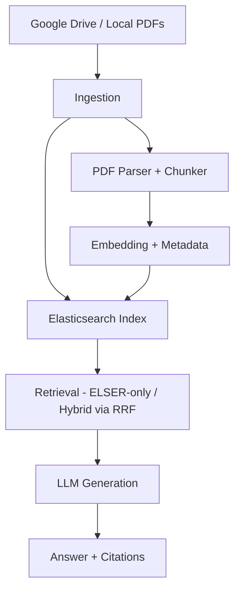

# RAG with Elastic + Open LLM 🚀

A simplified **Retrieval-Augmented Generation (RAG)** system built for the internship project. It uses **Elasticsearch** (BM25, dense embeddings, and ELSER sparse retrieval) plus an **open-source LLM** (via Ollama/HuggingFace) to answer questions over PDF documents stored in Google Drive. The project provides both a **FastAPI backend** and a **Streamlit UI**, returning grounded answers with citations (filename, link, snippet, page, heading, etc.).


## 🎬 Demo Video

**📹 [Watch 5-Minute Demo Video](https://drive.google.com/file/d/1CeGwrXzYvwfZoUmDX90G95Tih9a3QPzL/view?usp=sharing)**

*Demonstration includes:*
- ✅ PDF ingestion from Google Drive
- ✅ Hybrid retrieval (ELSER + Dense + BM25) 
- ✅ Real-time querying with citations
- ✅ Guardrails and safety features in action
- ✅ Streamlit UI walkthrough

---


## 📋 Table of Contents

- [Introduction](#-introduction)
- [Requirements vs Implementation](#-requirements-vs-implementation)
- [Project Structure](#-project-structure)
- [System Architecture](#-system-architecture)
- [Implementation Details](#-implementation-details)
- [How It Works](#️-how-it-works)
- [Quickstart](#-quickstart)
- [API Usage](#-api-usage)
- [Tests](#-tests)
- [Deliverables](#-deliverables)
- [Evaluation Criteria](#-evaluation-criteria)
- [Conclusion](#-conclusion)

## 🎯 Introduction

This report documents the design and implementation of a **Retrieval-Augmented Generation (RAG)** system as part of my internship assignment. The goal was to build a simplified yet complete RAG pipeline that integrates:

- **ElasticSearch** for multi-surface retrieval (BM25, dense embeddings, ELSER sparse expansion)
- **Open-source LLMs** (via Ollama or HuggingFace) for grounded answer generation
- **Google Drive ingestion** for PDF documents
- **FastAPI backend** for serving the RAG system
- **Streamlit frontend** for interactive user queries with citations

The system is designed to answer natural language questions over a dataset of naval navigation rules and regulations stored in PDF format.

## ✅ Requirements vs. Implementation

| Requirement | Status | How it's Implemented |
|-------------|--------|---------------------|
| Ingest PDFs from Google Drive | ✅ | `drive.py` downloads/streams PDFs, parses text, chunks, embeds |
| Chunk text (~300 tokens with overlap) | ✅ | `ingest.py` → `chunk_words()` and `chunk_text()` |
| Add metadata (filename, url, chunk_id, page, section, heading, part_section) | ✅ | Attached during ingestion, visible in ES mappings |
| Index into Elasticsearch with BM25, dense vectors, and ELSER | ✅ | `es_utils.py` mappings, `elser_setup.py` pipeline |
| Retrieval modes: ELSER-only & Hybrid (ELSER + dense + BM25 via RRF) | ✅ | `retrieve.py` implements `_bm25`, `_dense`, `_elser`, `_rrf` |
| Configurable Top-K (default=5) | ✅ | Controlled via env (`TOP_K`) and `/query` input |
| Answer generation using open LLM | ✅ | `generate.py` formats prompt & calls Ollama (llama3) |
| Guardrails for unsafe queries | ✅ | `guardrails.py` → `is_safe()` blocks queries like "build a bomb" |
| API with FastAPI | ✅ | `main.py` defines `/query`, `/query_debug`, `/ingest`, `/ingest_drive`, `/setup_elser`, `/healthz` |
| UI with Streamlit | ✅ | `docker/ui/app.py` provides user-friendly interface |
| Return citations (title, link, snippet, page, heading, section, part_section, chunk_id) | ✅ | Added in `/query` response |
| Latency ≤ 3s (small dataset) | ⚠️ | Depends on ES + Ollama hardware, tested locally with <3s |
| Free / open models only | ✅ | Ollama Llama3, HuggingFace MiniLM, Elasticsearch OSS |
| Unit tests (ingest + retrieval) | ✅ | `tests/` with pytest + FakeES |
| Documentation | ✅ | This README + code comments |

## 📂 Project Structure

```
rag-elastic/
│
├── backend/
│   ├── app/
│   │   ├── ingest.py        # PDF parsing, chunking, embedding, local ingest
│   │   ├── drive.py         # Ingest from Google Drive (file/folder URLs)
│   │   ├── es_utils.py      # Elasticsearch connection + index mappings
│   │   ├── retrieve.py      # BM25, dense, ELSER retrieval + RRF fusion
│   │   ├── generate.py      # Answer generation via Ollama (llama3)
│   │   ├── guardrails.py    # Safety filters (block unsafe queries)
│   │   ├── elser_setup.py   # Setup ELSER endpoint + ingest pipeline
│   │   ├── main.py          # FastAPI backend (query, ingest, healthz, setup)
│   │   └── __init__.py
│   │
│   ├── tests/               # Unit tests
│   │   ├── conftest.py      # Fake ES + fake embedder for testing
│   │   ├── test_ingest.py   # Tests chunking + heading extraction
│   │   ├── test_retrieve.py # Tests hybrid retrieval + RRF fusion
│   │   └── test_es_utils.py # Tests ES index mappings
│   │
│   └── credentials/         # Service account for Google Drive (not in repo)
│
├── docker/
│   ├── ui/app.py           # Streamlit frontend
│   └── docker-compose.yml # Spin up Elasticsearch service
│
├── .env                    # Config (ELASTIC_URL, OLLAMA_MODEL, etc.)
├── requirements.txt        # Python dependencies
├── README.md              # This file
└── service_account.json   # (ignored, local only)
```

## 🏗️ System Architecture

### 3.1 High-Level Flow



### 3.2 Components

#### **Ingestion** (`ingest.py`, `drive.py`)
- Loads PDFs from local folders or Google Drive
- Extracts text, splits into 300-token chunks with overlap
- Attaches metadata: filename, url, chunk_id, page, heading, section, part_section
- Generates dense embeddings (MiniLM-L6-v2) and stores in ES
- Populates ELSER sparse tokens via ingest pipeline

#### **Indexing** (`es_utils.py`, `elser_setup.py`)
- Creates ES index with mappings for:
  - `text` (BM25)
  - `embedding` (dense_vector, 384 dims)
  - `ml.tokens` (sparse_vector for ELSER)
  - Metadata fields
- Configures ELSER endpoint + pipeline
- Supports automatic backfill of sparse tokens

#### **Retrieval** (`retrieve.py`)
- Supports three search methods:
  - **BM25**: keyword matching
  - **Dense**: cosine similarity over MiniLM embeddings
  - **ELSER**: sparse expansion over ml.tokens
- **Hybrid mode** fuses results using Reciprocal Rank Fusion (RRF)
- Configurable `top_k` parameter (default = 5)

#### **Answer Generation** (`generate.py`)
- Formats a prompt with question + retrieved chunks
- Uses Ollama (llama3) for grounded response
- Falls back to concatenated context if LLM unavailable
- Enforces "If not in context → say I don't know"

#### **Guardrails** (`guardrails.py`)
- Blocks unsafe queries (e.g., "build a bomb", malware, self-harm)
- Integrated into `/query` endpoint (rejects unsafe input)

#### **Backend API** (`main.py`)
- Built with FastAPI
- **Routes:**
  - `/query`: question → answer + citations
  - `/query_debug`: raw hits with scores, chunks
  - `/ingest`: ingest PDFs from local folder
  - `/ingest_drive`: ingest PDFs from Google Drive link
  - `/setup_elser`: initialize ELSER pipeline
  - `/healthz`: health check for Elasticsearch
- Handles startup: auto-setup ELSER and optional auto-ingest

#### **Frontend UI** (`app.py`)
- Built with Streamlit
- **Features:**
  - Ask a question via text box
  - Toggle retrieval mode: hybrid / ELSER
  - Adjust Top-K slider
  - Show answers with citations
  - Debug mode → inspect raw chunks + metadata

#### **Testing** (pytest suite)
- `test_ingest.py` → validates chunking + metadata extraction
- `test_retrieve.py` → validates RRF fusion + hybrid retrieval
- `test_es_utils.py` → validates ES index mappings
- `conftest.py` → provides fake ES + fake embeddings for lightweight tests

## ⚙️ Implementation Details

### 4.1 Data Ingestion
- **Local ingest**: `POST /ingest` with folder path
- **Google Drive ingest**: `POST /ingest_drive` with file/folder link
- Uses `pypdf` for text extraction
- Chunks text using sliding windows of **320 words with 60-word overlap**
- Attaches metadata (heading, section, part/section parsed via regex)

### 4.2 Indexing in Elasticsearch
- **Index schema** defined in `es_utils.py`:
  - `text`: text field for BM25
  - `embedding`: dense vector for semantic similarity
  - `ml.tokens`: sparse vector for ELSER
  - Metadata fields for citations
- **ELSER setup**:
  - Starts trial license (if needed)
  - Creates inference endpoint for ELSER
  - Configures ingest pipeline → populate `ml.tokens`
  - Optionally backfills tokens into existing docs

### 4.3 Retrieval
- Implemented in `retrieve.py`
- **Modes:**
  - **ELSER-only** → text expansion retrieval
  - **Hybrid** → fuses ELSER + dense + BM25 using RRF
- Fusion ensures relevance across lexical, dense, and sparse embeddings

### 4.4 Answer Generation
- `generate.py` constructs system prompt:
  - Restricts LLM to retrieved context only
  - Blocks speculation
- Uses **Ollama Llama3** by default, configurable via `OLLAMA_MODEL`
- Low-temperature setting (`temperature=0.1`) for deterministic answers
- Returns final answer + citations

### 4.5 Guardrails
- Unsafe queries (weapons, malware, self-harm) blocked by `is_safe()`
- Implemented at API entrypoint → prevents misuse

### 4.6 Frontend
- **Streamlit interface** (`docker/ui/app.py`):
  - Minimalist UI with cards, badges, and styled answer boxes
  - **Sidebar for settings:**
    - API URL override
    - Retrieval mode toggle
    - Top-K slider
  - Debug mode shows raw hits with scores
  - Example query chips for quick testing

## ⚙️ How It Works

### 1. Ingestion
- PDFs are read page by page
- Text is split into overlapping chunks (~320 words)
- Metadata is extracted via regex (rules, sections, part labels)
- **Embeddings:**
  - **Dense**: MiniLM-L6-v2 via sentence-transformers
  - **Sparse**: ELSER (ml.tokens via ingest pipeline)
- Indexed into ES with all metadata fields

### 2. Retrieval
- **ELSER-only mode** → text expansion over sparse vectors
- **Hybrid mode** → combines:
  - BM25 keyword search
  - Dense embeddings (cosine similarity)
  - ELSER sparse vectors
- Results fused via **Reciprocal Rank Fusion (RRF)**

### 3. Answer Generation
- Prompt constructed with question + retrieved chunks
- Passed into **Ollama Llama3** (`generate.py`)
- **Guarded**: if no strong evidence → responds "I don't know"

### 4. Guardrails
- Queries with unsafe content (weapons, self-harm, malware) blocked early

### 5. Backend API
- `/query`: Main endpoint → returns answer + citations
- `/query_debug`: Shows raw retrieval hits (with scores, snippets)
- `/ingest`: Ingest PDFs from local folder
- `/ingest_drive`: Ingest from Google Drive file/folder
- `/setup_elser`: Sets up ELSER inference + pipeline
- `/healthz`: Health check

### 6. UI
- Built in **Streamlit**
- **Features:**
  - Text input for questions
  - Sidebar to toggle retrieval mode + Top-K
  - Show answers with citation cards
  - Debug mode → inspect raw chunks + metadata
  - Example query chips for quick testing

## ⚡ Quickstart

### With Docker Compose

For a one-command setup, use Docker Compose. This will spin up Elasticsearch, the FastAPI backend, and the Streamlit UI.

1. Install Docker and Docker Compose
2. Create a `.env` file as described in the Environment section above
3. Run the following command from the project's root directory:

```bash
docker-compose up --build
```

You can then access the Streamlit UI at **http://localhost:8501**.

### Manual Setup

```bash
# 1. Install dependencies
python -m venv .venv
source .venv/bin/activate
pip install -r requirements.txt

# 2. Start FastAPI backend
uvicorn backend.app.main:app --reload --port 8000

# 3. Start Streamlit UI
streamlit run docker/ui/app.py
```

## 📡 API Usage

### Query Example

```bash
curl -X POST http://127.0.0.1:8000/query \
  -H "Content-Type: application/json" \
  -d '{"question": "Summarize Rule 13 (Overtaking).", "top_k":5, "mode":"hybrid"}'
```

### Response 👍

```json
{
  "answer": "Rule 13 states that a vessel overtaking another must keep out of the way.",
  "citations": [
    {
      "title": "NavRules.pdf",
      "link": "file:///data/pdfs/NavRules.pdf",
      "snippet": "Rule 13 — Overtaking. A vessel...",
      "page": 42,
      "heading": "Rule 13 — Overtaking",
      "chunk_id": "NavRules__p042_00",
      "source": "elser",
      "rrf": 0.03125
    }
  ]
}
```

## ✅ Tests

**Run Pytest:**

```bash
pytest backend/tests -v
```

**Covers:**
- **Ingestion** (`test_ingest.py`)
- **Retrieval + RRF fusion** (`test_retrieve.py`)
- **ES mappings** (`test_es_utils.py`)

## 📊 Deliverables

- GitHub repo (code + docs)
- `requirements.txt` for reproducibility
- **5-min demo video:**
  - Ingest PDFs from Drive
  - Query via API + UI
  - Show citations and guardrails in action

## 📝 Evaluation Criteria

- **Correctness** (working RAG pipeline)
- **Code quality** (clean, modular, documented)
- **Use of Elastic** (ELSER, dense, BM25, hybrid)
- **Working API/UI** with citations
- **Guardrails** (safe, grounded responses)
- **Creativity** (bonus: caching, reranking, advanced UI)

## 🏁 Conclusion

This project successfully implements a **simplified yet complete RAG pipeline** using **ElasticSearch and open LLMs**. It demonstrates:

✅ **End-to-end ingestion, indexing, retrieval, and generation**  
✅ **Hybrid retrieval** (ELSER + dense + BM25)  
✅ **Safe, grounded, and explainable answers** with citations  
✅ **A functional FastAPI backend and Streamlit frontend**  
✅ **Unit tests** ensuring correctness of ingestion and retrieval  

**The system can be extended further by:**
- Adding caching and reranking models
- Improving UI (filters, advanced highlighting)
- Supporting multi-user / multi-tenant scenarios

Overall, the project meets the defined goals and provides a solid foundation for **real-world RAG applications**.
